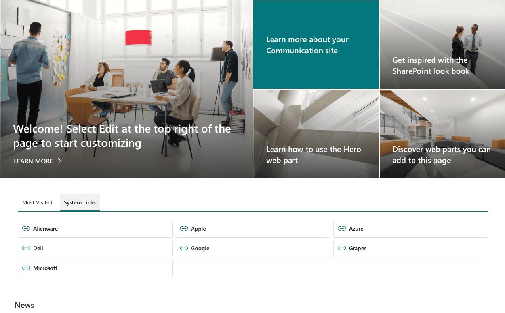
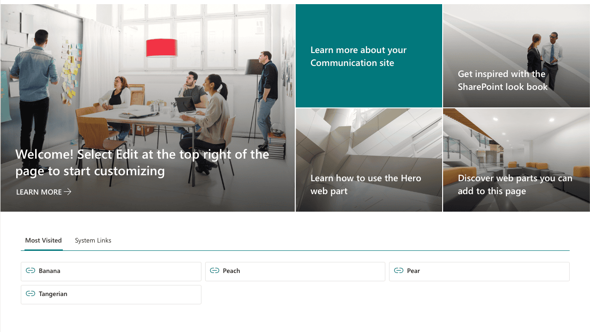
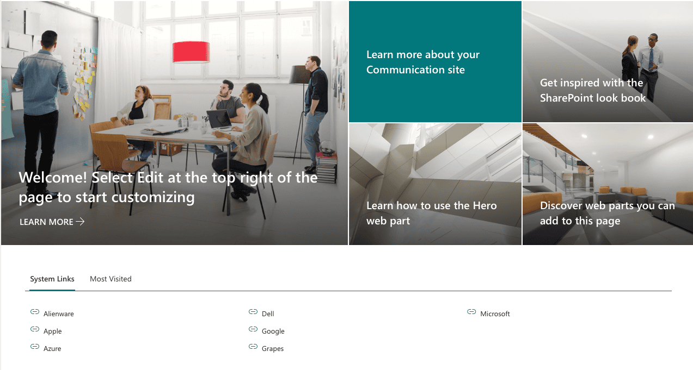
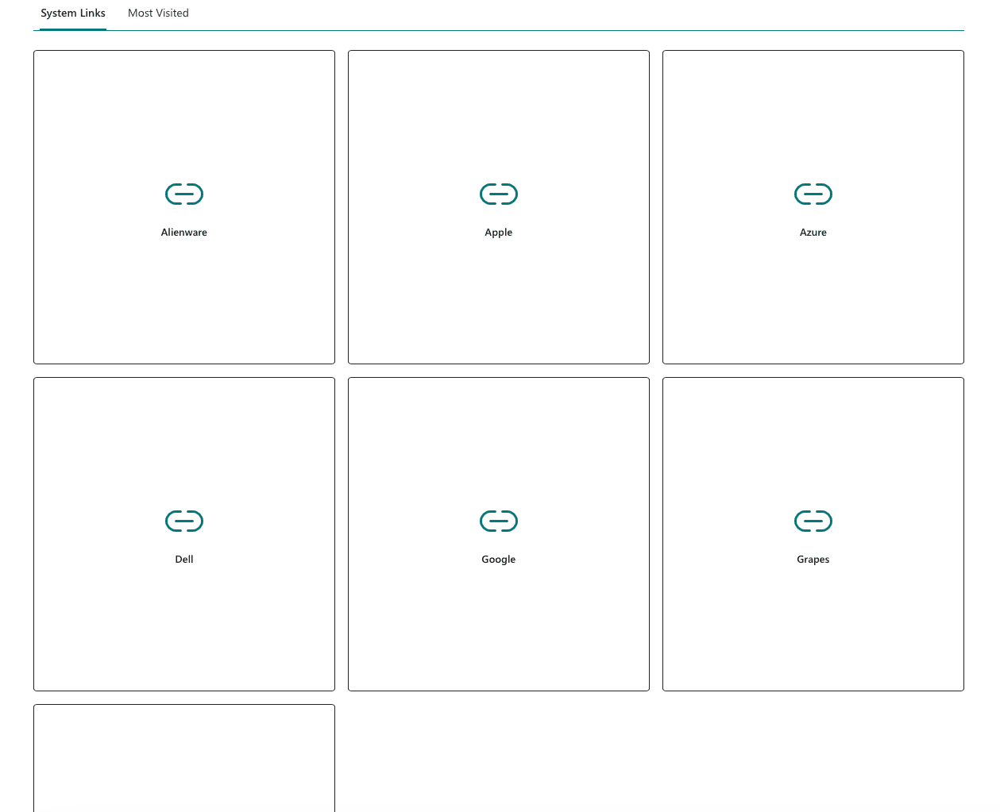
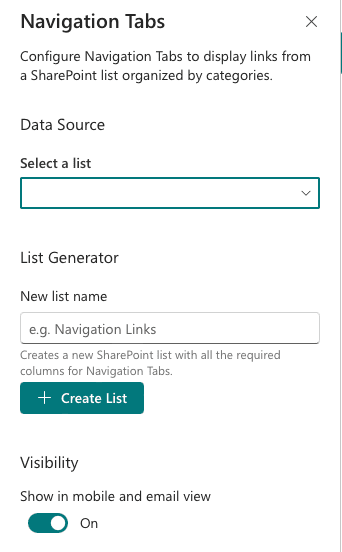
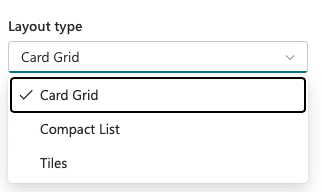
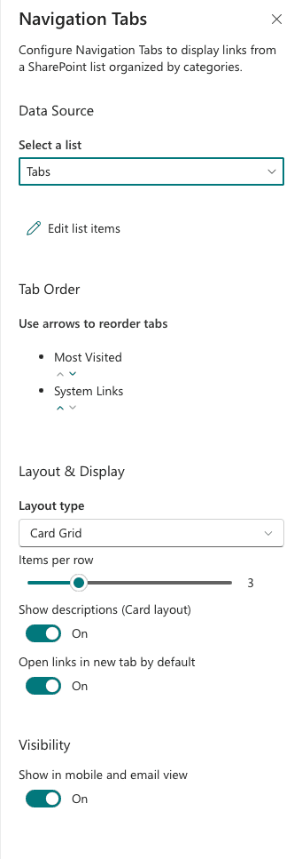

# Navigation Tabs Web Part

A SharePoint Framework (SPFx 1.22) web part that displays navigation links organized by tabbed categories. Links are stored in a SharePoint list and rendered in one of three layout styles.

**Author:** W. Kevin Wolff - [Wolff Creative LLC](https://www.wolffcreative.com)

## Features

- **Tabbed Categories** - Links are automatically grouped into tabs by their Category field
- **Three Layout Options** - Card, Compact, and Tile layouts to fit different page designs
- **Built-in List Generator** - Create a pre-configured SharePoint list directly from the property pane
- **Drag-and-Drop Tab Ordering** - Reorder category tabs from the property pane
- **Custom Icons** - Each link supports a Thumbnail/Image column for custom icons
- **Click Tracking** - Automatic click count tracking per link
- **Active/Inactive Toggle** - Hide links without deleting them using the IsActive field
- **Per-Link New Tab Control** - Override the default new tab behavior on individual links
- **Configurable Grid** - Adjust cards per row (2-6) for Card and Tile layouts
- **Works in SharePoint and Teams** - Supported as a SharePoint web part, Teams tab, and Teams personal app

## Screenshots

### Card Grid
Links displayed as a grid of cards with icons and titles, organized by category tabs.



### Card Grid with Tab Switching
Switching between category tabs — each tab shows its own set of links.



### Compact List
A dense list view ideal for pages with limited space.



### Tiles
Large icon tiles for a visual, app-launcher style experience.



### Property Pane — Setup Mode
First-time configuration: select an existing list or create a new one with the built-in List Generator.



### Property Pane — Configured Mode
Full settings: list selection, tab reordering, layout type, items per row, and display toggles.



### Layout Type Selector
Choose between Card Grid, Compact List, or Tiles.



## List Schema

The web part reads from a SharePoint list with the following columns. You can create this list automatically using the built-in List Generator, or create it manually.

| Column | Type | Required | Description |
|--------|------|----------|-------------|
| Title | Single line of text | Yes | Display name for the link |
| LinkURL | Hyperlink | Yes | Destination URL |
| Category | Choice | Yes | Tab category (e.g., General, Resources, Tools) |
| LinkDescription | Multiple lines of text | No | Description shown in Card layout |
| LinkIcon | Image (Thumbnail) | No | Custom icon for the link |
| SortOrder | Number | No | Sort order within a category (default: 100) |
| OpenInNewTab | Yes/No | No | Override the web part's default new tab setting |
| IsActive | Yes/No | No | Set to No to hide a link without deleting it |
| ClickCount | Number | No | Auto-incremented click counter (hidden from forms) |

## Prerequisites

- [Node.js](https://nodejs.org/) v18.17.1+, v20.9.0+, or v22.0.0+
- SharePoint Online tenant with App Catalog
- Site Collection Administrator permissions (to deploy the package)

## Getting Started

### 1. Clone the repository

```bash
git clone https://github.com/wkwolff/navigation-tabs-webpart.git
cd navigation-tabs-webpart
```

### 2. Install dependencies

```bash
npm install
```

### 3. Configure your tenant

Edit `config/serve.json` and replace the placeholder with your SharePoint tenant URL:

```json
{
  "initialPage": "https://{your-tenant}.sharepoint.com/_layouts/15/workbench.aspx"
}
```

### 4. Trust the development certificate

```bash
npx heft run --only trust-dev-cert
```

### 5. Start the development server

```bash
npm start
```

Then open your SharePoint hosted workbench at:
```
https://{your-tenant}.sharepoint.com/_layouts/15/workbench.aspx
```

> **Note:** The local workbench was removed in SPFx 1.13+. You must use the hosted workbench on your SharePoint tenant.

## Build Commands

| Command | Description |
|---------|-------------|
| `npm start` | Start the dev server with hot reload |
| `npm run build` | Build the project |
| `npm run clean` | Clean build output |
| `npm run package` | Build and package the .sppkg for production |

## Deployment

### 1. Build the package

```bash
npm run package
```

This produces `sharepoint/solution/navigation-tabs.sppkg`.

### 2. Upload to App Catalog

1. Go to your SharePoint App Catalog site (e.g., `https://{your-tenant}.sharepoint.com/sites/appcatalog`)
2. Navigate to **Apps for SharePoint**
3. Upload `navigation-tabs.sppkg`
4. Check **Make this solution available to all sites in the organization** if you want tenant-wide deployment
5. Click **Deploy**

### 3. Add to a page

1. Navigate to any SharePoint page and click **Edit**
2. Click **+** to add a web part
3. Search for **Navigation Tabs** and add it
4. Open the property pane to configure:
   - **Select a list** from the dropdown, or use the **List Generator** to create one
   - Choose a **layout type** (Card, Compact, or Tile)
   - Adjust **cards per row**, **descriptions**, and **new tab** settings
   - **Drag and drop** to reorder category tabs

## Configuration

### Property Pane Options

| Setting | Description | Default |
|---------|-------------|---------|
| List | SharePoint list containing navigation links | *(none)* |
| Layout Type | Card, Compact, or Tile | Card |
| Cards Per Row | Number of items per row (2-6) | 3 |
| Show Descriptions | Display link descriptions (Card layout only) | Yes |
| Open in New Tab | Default behavior for link clicks | Yes |
| Tab Order | Drag-and-drop reordering of category tabs | *(auto-detected)* |

## Project Structure

```
src/webparts/navigationTabs/
├── NavigationTabsWebPart.ts          # Web part entry point and property pane
├── NavigationTabsWebPart.manifest.json
├── INavigationTabsWebPartProps.ts    # Property interface
├── components/
│   ├── NavigationTabs.tsx            # Main React component
│   ├── TabContainer.tsx              # Tab switching container
│   ├── NoConfiguration.tsx           # Empty state prompt
│   ├── LinkIcon.tsx                  # Icon renderer
│   └── layouts/
│       ├── CardLayout.tsx            # Card grid layout
│       ├── CompactLayout.tsx         # Compact list layout
│       ├── TileLayout.tsx            # Tile grid layout
│       └── LinkLayoutRenderer.tsx    # Layout switcher
├── services/
│   ├── pnpjsConfig.ts               # PnPjs initialization
│   └── NavigationLinksService.ts     # List data access and click tracking
├── models/
│   ├── INavigationLink.ts           # Link data interface
│   └── LayoutType.ts                # Layout type enum
└── loc/
    ├── mystrings.d.ts               # Localization interface
    └── en-us.js                     # English strings
```

## Technology Stack

- **SharePoint Framework (SPFx) 1.22** with Heft build toolchain
- **React 17** with TypeScript 5.6
- **PnPjs v4** for SharePoint data access
- **Fluent UI React** (provided by SPFx runtime)
- **@pnp/spfx-property-controls** for list picker and drag-and-drop ordering

## Contributing

Contributions are welcome! Please open an issue or submit a pull request.

1. Fork the repository
2. Create a feature branch (`git checkout -b feature/my-feature`)
3. Commit your changes (`git commit -m 'Add my feature'`)
4. Push to the branch (`git push origin feature/my-feature`)
5. Open a Pull Request

## License

This project is licensed under the MIT License - see the [LICENSE](LICENSE) file for details.

## Author

**W. Kevin Wolff** - [Wolff Creative LLC](https://www.wolffcreative.com)
